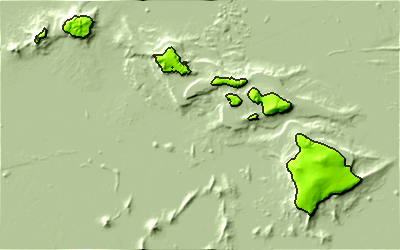
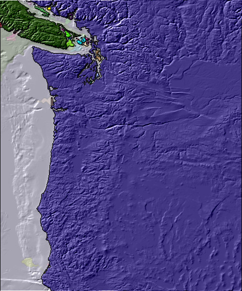
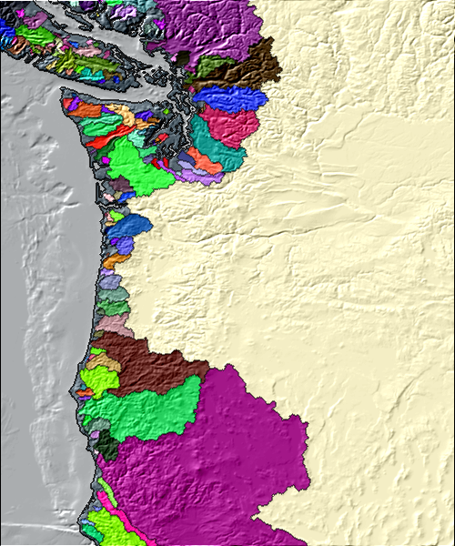

# mapalgo
This library contains many python methods to process maps for interesting analyses -- usually about cities and mountain ranges.

## Images ##

| Dataset | Elevation | Mountains | Islands | Drainage Basins |
| -- | -- | -- | -- | -- |
| Hawaii (1 minute resolution) |  |  |  |  |
| Pacific Northwest (1 minute resolution) |  |  |  |  |
| World (10 minute resolution) |  |  |  |  |
