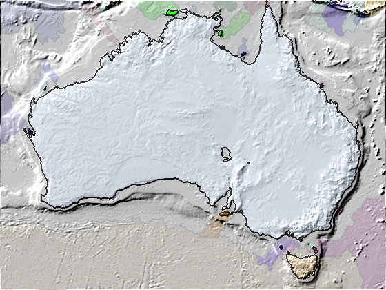
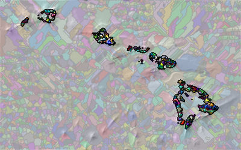
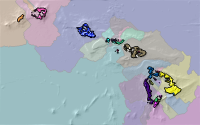
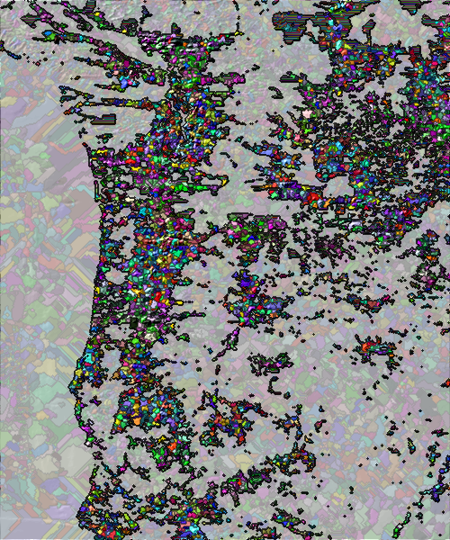
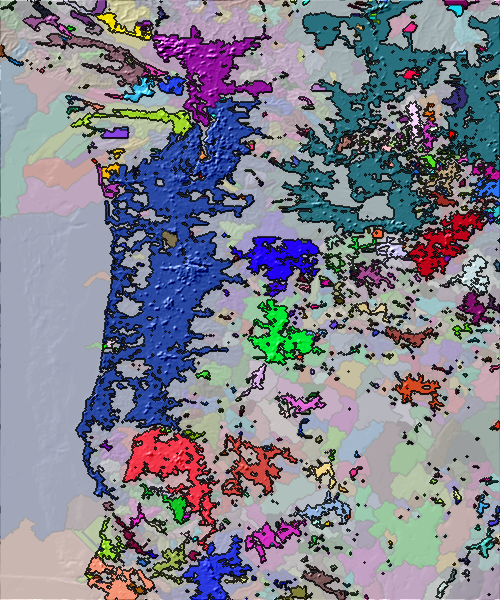

# mapalgo
This library contains many python methods to process maps for interesting analyses -- usually about cities and mountain ranges.

## Images ##

### Elevation

| Dataset | Elevation | Mountains | Islands | Drainage Basins |
| -- | -- | -- | -- | -- |
| Hawaii (1 minute resolution) |  |  |  |  |
| Pacific Northwest (1 minute resolution) |  |  |  |  |
| Australia (5 minute resolution) |  |  |  |  |
| World (10 minute resolution) |  |  |  |  |

### Population

Note: For areas with no people, it counts the elevation relative to sea level. This favors grouping remote areas that are more easily accessible to areas with people.

At this moment, the 1 minute resolution data is using a slightly different algorithm -- to be updated.

| Dataset | Population | Cities | Urban Areas | Voids (Poorly Defined) |
| -- | -- | -- | -- | -- |
| Hawaii (1 minute resolution) |  |  |  |  |
| Pacific Northwest (1 minute resolution) |  |  |  |  |
| Australia (5 minute resolution) |  |  |  |  |
| World (10 minute resolution) |  |  |  The 10 minute version takes too long to generate |  The 10 minute version takes too long to generate |
