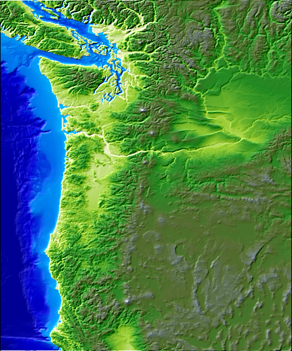

# mapalgo
This library contains many python methods to process maps for interesting analyses -- usually about cities and mountain ranges.

## Images ##

### World Elevation ###

### Pacific Northwest Elevation ###

### Hawaii ###

Elevation

Mountains

